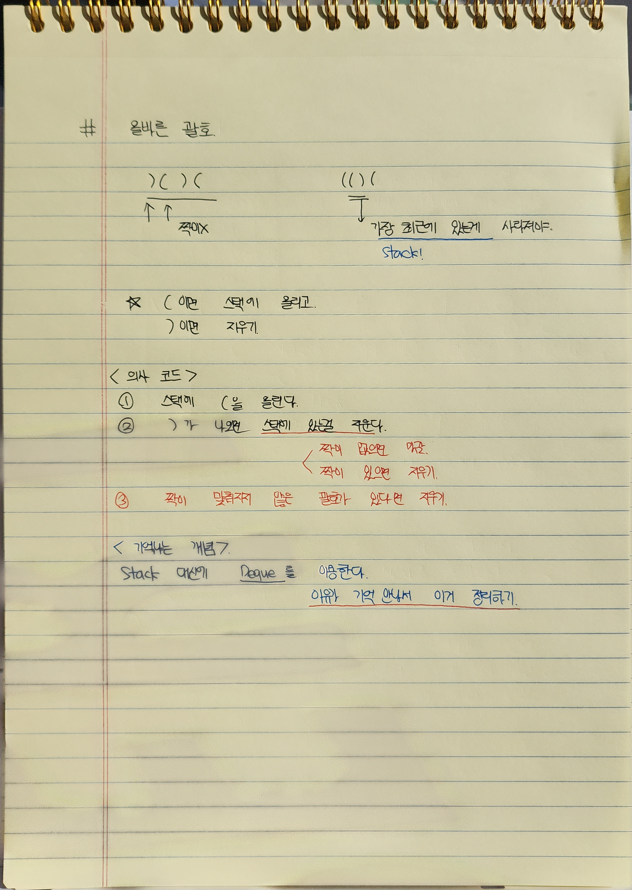

이번에는 흐름을 잘 잡아서 작성하는데 힘을 좀 썼다. 습관 들여야 해서…
### 사고 흐름


### 정확도 테스트

```java
테스트 1 〉	통과 (0.11ms, 76MB)
테스트 2 〉	통과 (0.04ms, 86.8MB)
테스트 3 〉	통과 (0.05ms, 83.7MB)
테스트 4 〉	통과 (0.12ms, 81.4MB)
테스트 5 〉	통과 (0.17ms, 84.1MB)
테스트 6 〉	통과 (0.06ms, 69.8MB)
테스트 7 〉	통과 (0.12ms, 74MB)
테스트 8 〉	통과 (0.13ms, 79.3MB)
테스트 9 〉	통과 (0.12ms, 82.6MB)
테스트 10 〉	통과 (0.17ms, 89.9MB)
테스트 11 〉	통과 (0.14ms, 80.5MB)
테스트 12 〉	통과 (0.16ms, 77.3MB)
테스트 13 〉	통과 (0.27ms, 75.1MB)
테스트 14 〉	통과 (0.18ms, 79.9MB)
테스트 15 〉	통과 (0.16ms, 73.7MB)
테스트 16 〉	통과 (0.17ms, 72.6MB)
테스트 17 〉	통과 (0.20ms, 76.3MB)
테스트 18 〉	통과 (0.16ms, 84.6MB)
```

### 효율성 테스트
```java
테스트 1 〉	통과 (13.25ms, 54.9MB)
테스트 2 〉	통과 (15.27ms, 54.3MB)
```