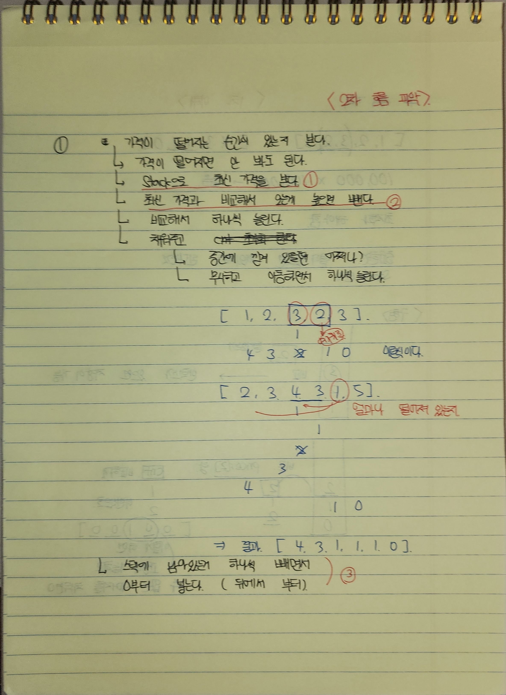

## 풀이
### 1차 문제 이해

- 이번에는, 실전이라면 코테를 어떻게 접근해야 하는지 초점을 잡아서 구현했다.
- 다음과 같이, 우선 문제를 보고 직접 그려보며 이해한다.
- 이해하면서 가능하다면, 어떤 **알고리즘**으로 접근해야 할지도 살펴본다.

### 2차 요구사항 정리

- 구현을 위해서는 어떻게 돌아가야 하는지를 정리해야 한다.
- 다음과 같이 ~이렇다면? 을 기준으로 정리해서 풀어서 썼다.
- 진짜 구현을 해야 하는 부분을 빨간줄로 표기한다.
- 빨간줄이 주석이 되어, 프로그래머스에 적힌다.
  - 이 흐름에 따라 구현을 진행할 것이다.

### 풀이 결과
```java
import java.util.*;
import java.lang.*;

class Solution {
    public int[] solution(int[] prices) {
        int[] answer = new int[prices.length];
        // 1. 스택으로 최신 가격을 본다.
        Deque<Integer> stack = new ArrayDeque<Integer>();
        // 2. 최신 가격과 비교해서, 이전 가격이 높으면 뺀다.
        for(int i = 0; i<prices.length; i++){
            while(!stack.isEmpty() && prices[stack.peek()] > prices[i]){
                int prePriceIdx = stack.pop();
                // 3. 최신 가격 기준, 얼마나 떨어져 있느냐를 보면 된다.
                answer[prePriceIdx] = i-prePriceIdx;
            }
            stack.push(i);
        }
        // 4. 스택에 남아있는거 하나씩 뺀다.
        while(!stack.isEmpty()){
            int prePriceIdx = stack.pop();
            answer[prePriceIdx] = prices.length-1-prePriceIdx;
        }
        return answer;
    }
}
```
### 정확성 테스트
```java
테스트 1 〉	통과 (0.07ms, 74.6MB)
테스트 2 〉	통과 (0.25ms, 86.6MB)
테스트 3 〉	통과 (0.99ms, 94.9MB)
테스트 4 〉	통과 (1.02ms, 76.3MB)
테스트 5 〉	통과 (0.78ms, 77.4MB)
테스트 6 〉	통과 (0.10ms, 82.4MB)
테스트 7 〉	통과 (0.82ms, 88.8MB)
테스트 8 〉	통과 (0.65ms, 88.6MB)
테스트 9 〉	통과 (0.14ms, 85.6MB)
테스트 10 〉	통과 (0.99ms, 94.6MB)
```
### 효율성 테스트
```java
테스트 1 〉	통과 (29.34ms, 88.7MB)
테스트 2 〉	통과 (19.07ms, 66MB)
테스트 3 〉	통과 (28.38ms, 74.9MB)
테스트 4 〉	통과 (23.24ms, 70.3MB)
테스트 5 〉	통과 (19.01ms, 69.7MB)
```